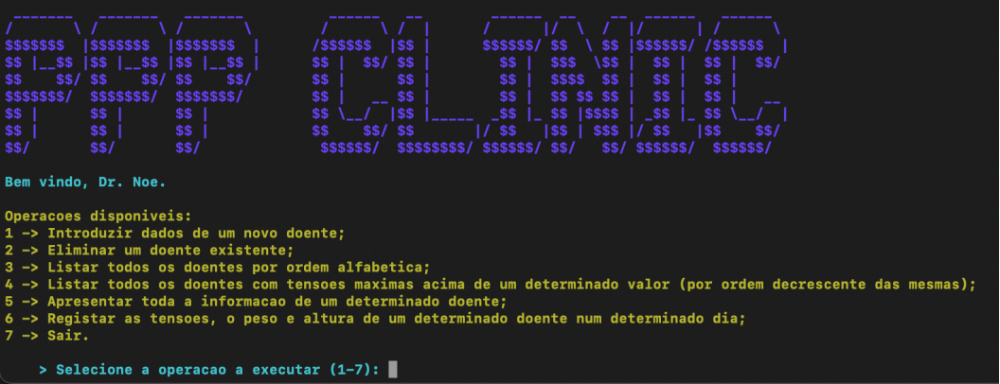

# Patient Management - Procedural Programming Principles



Project developed for the Procedural Programming Principles course (2023-24) of the Informatics Engineering Bachelor's degree. It consists of a C application to manage a doctor's patients, as well as their respective clinical records, using dynamic data structures (linked lists) and data persistence in text files.

## Main Features

The application features an interactive menu that allows performing the following operations:

1. Insert data for a new patient (name, date of birth, national ID card, phone number, email).
2. Delete an existing patient, using a search mechanism by ID or Name.
3. List all patients in alphabetical order.
4. List patients with maximum blood pressures above a specified limit (records presented in descending order of blood pressure).
5. Display all information and clinical history of a specific patient.
6. Register new clinical data (maximum blood pressure, minimum blood pressure, weight, and height) for a patient on a specific date.
7. Safely terminate the program execution.

## Architecture and Data Structures

The project was designed focusing on modularity, memory efficiency, and optimization of read/write operations:

* Linked Lists and Efficient Sorting: Data is kept in memory through linked lists (`lista_doentes_t` and `lista_registos_t`). The patient list is kept alphabetically sorted at the time of insertion.
* Multiple Pointers: To avoid memory duplication of records, the clinical records list of each patient has two simultaneous sorting levels within the same node (`l_node_registo_t`). One pointer (`next`) links the records chronologically, while an auxiliary pointer (`nextTensao`) links the exact same records in descending order of maximum blood pressure.
* Robust Data Validation: The system includes integrity checks for user inputs:
  * Names: Only alphabetic characters.
  * Dates: Strict calendar verification, including leap years and day/month matching.
  * National ID Card: Validation using the official verification algorithm.
  * Phone Number: Exclusive acceptance of 9-digit numbers starting with 9.
  * Email: Format validation (presence of '@' and correct domain structuring).
* Modularity: The code is divided into logical modules (`listadoentes`, `listaregistos`, `misc`, etc.) stored in the `/lib/` directory.

## Data Persistence

All relevant information is loaded into memory at the start of the program (`carregarDoentes()` and `carregarRegistos()`) from text files (`doentes.txt` and `registos.txt`). 
To optimize performance, adding new patients or records uses the "append" method at the end of the respective files. A complete rewrite of the files only occurs during data removal operations, guaranteeing integrity and preventing data loss.

## How to Compile and Run

The project uses CMake to generate the build process. To compile and run the application, follow these steps in the terminal:

```bash
# 1. Create and enter the build directory
mkdir build
cd build

# 2. Generate dependencies with CMake
cmake ..

# 3. Compile the source code
make

# 4. Run the application
./projeto-ppp
```
*(Note: Ensure that the text files for the data are located in the correct directory according to the source code).*
